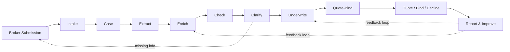
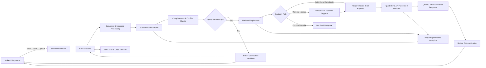
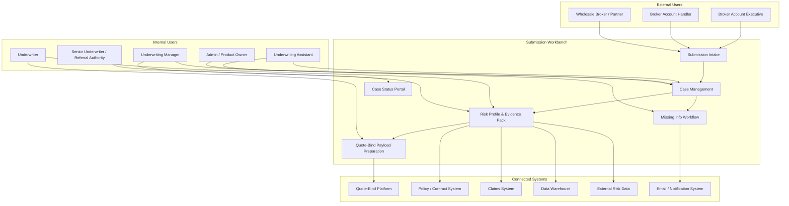
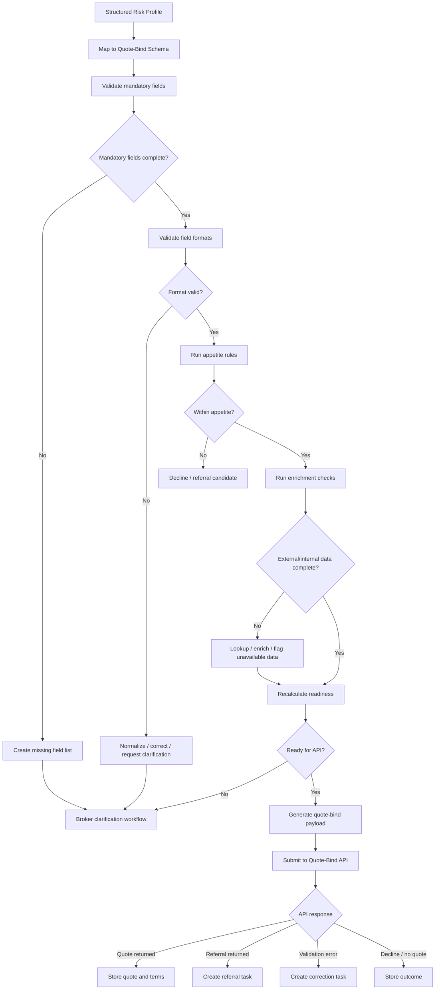
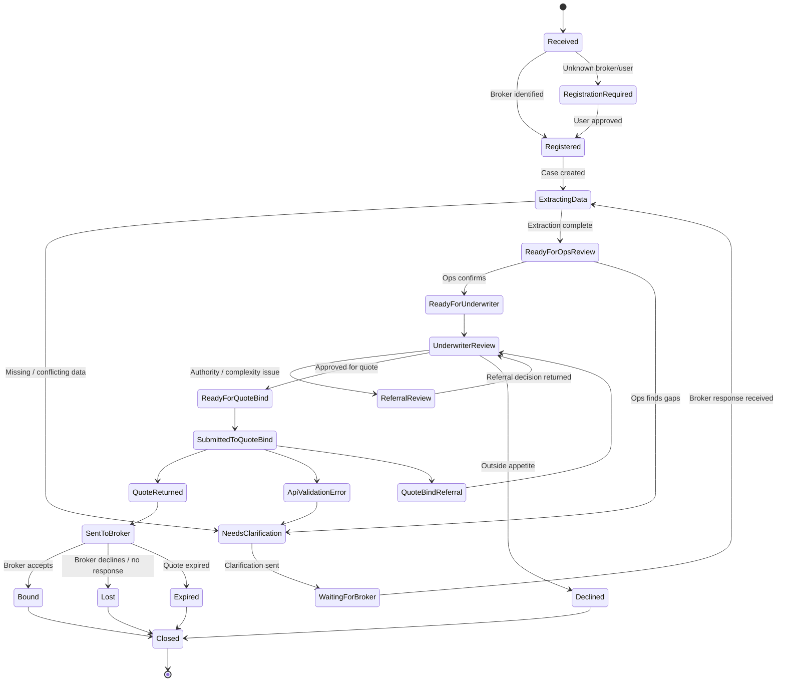

# ERGO Specialty - Submission Workbench Discovery Pilot

**Prepared by:** Corvendor GmbH

**Purpose:** Follow-up suggestion after discussion on the underwriting workbench and the "middle part" between broker submissions and quote-bind / underwriting systems.

**Status:** Draft for discussion

------

# 1. Executive briefing

## 1.1 Situation

ERGO is considering how to digitize underwriting submission handling and how to connect broker submissions, internal underwriting work, data sources, and a future licensed quote-bind service.

The strategic direction is clear: underwriting should become faster, more structured, more transparent, and easier to manage. The open question is what the future workbench should actually contain and how the "middle part" should work in practice.

This middle part is where much of the operational value sits:

- broker emails, forms, uploads, and attachments arrive in different formats;
- required information may be missing, inconsistent, or hidden inside documents;
- underwriters need a reliable risk summary, not just raw files;
- internal claims, contracts, broker, and portfolio data may need to be considered;
- the future quote-bind service will require structured input;
- decisions, clarifications, evidence, and status changes need to be logged and reported.

Trying to specify all of this through abstract workshops alone would be slow and incomplete. The better approach is to build a limited working slice and use it to discover the real requirements.

## 1.2 Suggested approach

We suggest a **Submission Workbench Discovery Pilot**.

The pilot is a discovery-by-implementation exercise. It creates a limited but working version of the future submission workbench around representative broker-style cases.

The purpose is twofold:

1. **Demonstrate capability** - show what the workbench can do in terms of intake, case handling, extraction, missing-information handling, underwriting support, and quote-bind readiness.
2. **Create reusable project assets** - produce structures, field definitions, workflow states, input patterns, status models, reporting needs, and API-readiness assumptions that will be needed anyway for the larger digitization project.

The pilot is not a detour from the future workbench. It is the fastest practical way to define it.

## 1.3 Core statement

If ERGO wants to move underwriting submission handling into a genuinely digital workflow, certain building blocks will be required in any case: submission intake, case management, field mapping, evidence tracking, missing-information workflows, audit trail, quote-bind readiness, and reporting.

The pilot brings this work forward, makes it visible, and turns uncertainty into testable artefacts.

## 1.4 Expected benefits

The pilot helps ERGO understand both **what is needed** and **what can be gained**.

Expected benefits include:

- faster understanding of the real workbench requirements;
- reduced dependency on abstract whiteboard sessions;
- clearer view of broker input formats and common data gaps;
- practical understanding of what a structured underwriting case should contain;
- early demonstration of underwriter support and case summarisation;
- better preparation for quote-bind vendor discussions;
- better definition of required API payloads and validation logic;
- visibility of missing or conflicting information before underwriter review;
- reusable case model, status model, field catalogue, and reporting structure;
- measurable baseline for speed, completeness, reliability, and manual workload;
- lower risk for the later full application build.

## 1.5 Important boundary

The pilot does **not** aim to replace the licensed quote-bind platform.

It focuses on the upstream and surrounding layer:

> broker submission -> managed case -> structured risk profile -> enrichment -> missing-information workflow -> underwriting support -> quote-bind-ready payload.

This layer will be needed regardless of which quote-bind service is selected.

------

# 2. How to get started

## 2.1 Proposed working mode

The most practical next step is an iterative working cycle:

1. Corvendor prepares a first working slice using representative assumptions and agreed sample structures.
2. ERGO reviews the working version in a short follow-up meeting.
3. Both parties discuss what looks right, what is missing, and what must be changed.
4. Corvendor continues development based on the feedback.
5. The cycle repeats until ERGO has a clear view of the workbench concept, scope, benefits, and implementation path.

The aim is not to collect every detail upfront. The aim is to create something concrete enough that the real questions become visible.

## 2.2 Minimum input needed to begin

To start effectively, the following would be helpful:

- 10-20 anonymized representative broker submissions, preferably including emails and attachments;
- one selected product or class of business for the first pilot scope;
- a rough list of fields normally required before a quote can be prepared;
- examples of common missing-information situations;
- a basic description of current status stages from submission to quote / decline / bind;
- any available sample output expected by a quote-bind platform, even if not final;
- a nominated operational contact who can review assumptions quickly.

If anonymized real cases are not initially available, Corvendor can start with synthetic but realistic sample cases and replace them with real examples later.

## 2.3 Suggested first meeting after preparation

The next meeting should not be a blank-page workshop. It should be a review of a first working version.

Suggested agenda:

1. Demonstration of the working flow.
2. Review of user roles and case lifecycle.
3. Review of extracted / structured risk profile.
4. Discussion of missing-information and conflict checks.
5. Review of underwriter summary and evidence concept.
6. Discussion of quote-bind readiness and API assumptions.
7. Agreement on the next iteration.

## 2.4 Development / test access

There are two practical options.

### Option A - Corvendor-hosted development sandbox

Corvendor hosts a restricted development instance for demonstration and review.

Advantages:

- fastest start;
- no early dependency on ERGO infrastructure;
- useful for concept validation and stakeholder demos;
- easier iteration.

Limitations:

- only anonymized or synthetic data should be used;
- no direct connection to sensitive internal systems in the first phase;
- security and compliance requirements for later production still need separate review.

### Option B - ERGO-controlled sandbox

The pilot is deployed into a sandbox environment controlled by ERGO.

Advantages:

- closer to future IT and security requirements;
- easier to test identity, data access, and internal integrations;
- stronger foundation for later production transition.

Limitations:

- slower setup;
- more dependency on internal IT capacity;
- less suitable for very early exploration.

### Recommended start

Start with **Option A** for speed, using anonymized or synthetic cases, and define a transition path to Option B once the concept is validated.

## 2.5 Use of existing Corvendor capabilities

At some point, the pilot needs to become an application rather than a presentation prototype.

Corvendor can reduce time and risk by building on existing Peril Manager capabilities. The Peril Manager already contains application-level building blocks that are relevant for this type of system, including:

- user and access concepts;
- file management;
- email / communication capabilities;
- pipeline or workflow-style processing;
- data processing and case-related structures;
- existing experience with insurance risk and property-related data.

This does not mean the future workbench is simply the Peril Manager. It means that Corvendor can reuse proven application foundations instead of starting from a blank page.

------

# 3. Working specification

## 3.1 Objective

Build a limited but working submission workbench pilot that demonstrates how messy broker input can become a structured underwriting case and, ultimately, a quote-bind-ready risk profile.

The pilot should help answer:

- what the future workbench needs to do;
- which users need which functions;
- what data is required;
- where missing or conflicting information occurs;
- which information can be extracted or enriched;
- which steps can be semi-automated;
- what the quote-bind API layer will need;
- what operational and management reporting should show.

## 3.2 Situation

Today, broker submissions may arrive in different formats and with different levels of completeness. The work required before a case can be underwritten or passed to a quote-bind system is often hidden in manual tasks:

- reading emails and attachments;
- identifying product / risk type;
- extracting key fields;
- checking whether information is complete;
- looking up related internal or external data;
- asking brokers for clarification;
- preparing an underwriting summary;
- routing the case to the right person;
- preparing structured input for quote, referral, decline, or bind;
- recording decisions and communication.

This is the middle part that should become digital, measurable, and easier to operate.

## 3.3 Motivation

The main motivation is to accelerate the digitization journey.

Instead of spending months trying to define the future system in abstract terms, the pilot creates a working version of the essential middle layer. This helps ERGO learn from real or representative cases and make better decisions about process design, vendor selection, data integration, and future implementation.

The pilot should therefore be judged not only as a demo, but as a practical discovery and delivery accelerator.

## 3.4 Gains and measures

The pilot should make benefits measurable from the beginning.

Suggested measures:

| Area                    | Example measure                                              |
| ----------------------- | ------------------------------------------------------------ |
| Submission handling     | Time from submission received to case created                |
| Data completeness       | Percentage of mandatory fields available on first receipt    |
| Extraction              | Percentage of selected fields extracted correctly            |
| Missing information     | Number and type of missing fields detected                   |
| Conflict handling       | Number of conflicting values identified                      |
| Underwriter preparation | Time saved before underwriter review                         |
| Broker communication    | Number of clarification cycles per case                      |
| Quote-bind readiness    | Percentage of cases ready for structured payload generation  |
| Operational control     | Case status visibility and ageing                            |
| Management reporting    | Submissions by broker, product, status, outcome, delay reason |

The most important operational measure is likely:

> time from broker submission to underwriting-ready / quote-bind-ready case.

## 3.5 User roles

### Broker / requester

External user submitting a risk or responding to clarification requests.

Needs:

- simple submission route;
- confirmation with case ID;
- ability to upload additional files;
- status visibility;
- clear requests for missing information.

### Underwriting operations

Internal user handling intake, completeness checks, clarification, and routing.

Needs:

- queue of new submissions;
- extracted field view;
- missing and conflicting data flags;
- communication templates;
- ability to confirm or correct extracted values;
- ability to route cases.

### Underwriter

Decision owner for risk review, referral, terms, decline, or quote preparation.

Needs:

- structured risk profile;
- summary of key facts;
- source evidence;
- confidence / completeness indicators;
- internal and external enrichment results;
- referral and appetite indicators;
- quote-bind payload preview.

### Senior underwriter / referral authority

Handles cases outside standard authority or requiring escalation.

Needs:

- referral reason;
- decision history;
- evidence pack;
- suggested decision options;
- authority and override logging.

### Underwriting manager

Monitors portfolio, workload, quality, and process performance.

Needs:

- reporting by broker, product, status, underwriter, outcome;
- cycle-time analysis;
- missing-information patterns;
- referral reasons;
- quote / bind / decline conversion;
- operational bottlenecks.

### Admin / product owner

Maintains rules, required fields, workflows, templates, and system settings.

Needs:

- product configuration;
- required field definitions;
- workflow status configuration;
- broker/user management;
- template management;
- integration settings.

## 3.6 Incoming data

The pilot should support at least one or two realistic input routes.

Possible input channels:

- forwarded email;
- dedicated submission mailbox;
- web upload;
- structured form;
- broker platform export or future integration.

Possible input documents:

- broker email;
- proposal form;
- property schedule;
- claims history;
- current or expiring policy schedule;
- Excel schedule;
- survey report;
- risk improvement report;
- photos;
- additional broker notes.

Possible extracted business data:

- insured name;
- broker name and contact;
- risk address / property list;
- postcode;
- occupancy;
- construction;
- property type;
- year built / age;
- sums insured / limits;
- cover sections;
- claims history;
- inception date;
- expiring insurer / premium;
- requested cover;
- special terms or requirements;
- attachments and source references.

## 3.7 Case management

Every submission should become a managed case.

A case should include:

- case ID;
- submission source;
- broker / requester;
- product or risk class;
- status;
- assigned user / team;
- original documents;
- extracted fields;
- evidence links;
- missing information;
- conflicts;
- enrichment results;
- communication history;
- decision log;
- quote-bind readiness status;
- final outcome.

Suggested status lifecycle:

- received;
- registered;
- extracting data;
- needs clarification;
- waiting for broker;
- ready for operations review;
- ready for underwriter;
- underwriter review;
- referral review;
- ready for quote-bind;
- submitted to quote-bind;
- quote returned;
- sent to broker;
- bound;
- declined;
- lost;
- expired;
- closed.

## 3.8 Structured risk profile

The structured risk profile is the central internal object.

It should be vendor-neutral and independent of the final quote-bind platform. The quote-bind API adapter can later transform this profile into the exact vendor payload.

The structured risk profile should include:

- insured data;
- broker data;
- risk address data;
- property characteristics;
- cover requirements;
- claims history;
- risk indicators;
- internal context;
- external enrichment;
- appetite indicators;
- referral indicators;
- quote-bind readiness information;
- source evidence.

This protects ERGO from designing the whole process around a vendor-specific API too early.

## 3.9 Missing-information and conflict handling

The pilot should demonstrate how the system detects incomplete or inconsistent submissions.

Examples:

- mandatory field missing;
- invalid postcode;
- conflicting sums insured in email and attachment;
- occupancy unclear;
- claims history missing;
- inception date missing;
- insured name inconsistent across documents;
- property schedule does not match summary;
- attachment referenced but not provided.

The system should create a missing-information list and support a clarification workflow.

Possible output:

- internal task for underwriting operations;
- draft broker email;
- portal notification;
- case status update;
- follow-up reminder.

## 3.10 Evidence and audit trail

The system should make extracted information trustworthy.

For important fields, the workbench should show:

- extracted value;
- source document or email;
- page / section / attachment reference where possible;
- extraction confidence;
- reviewed / confirmed status;
- user who confirmed or changed the value;
- timestamp.

This is essential for underwriter trust, compliance, and later model improvement.

## 3.11 Data enrichment and warehouse merge

The pilot should show where additional information could improve underwriting and case handling.

Potential internal data sources:

- existing policies;
- previous quotes;
- claims history;
- broker performance;
- portfolio data;
- appetite guides;
- authority limits;
- pricing / rating assumptions;
- previous declinatures or referrals.

Potential external data sources:

- address validation;
- geocoding;
- flood / subsidence / storm / freeze / theft indicators;
- property classification;
- company information;
- sanctions or compliance checks where relevant.

The pilot does not need to integrate all sources. It should demonstrate the pattern and identify which sources matter most.

## 3.12 Underwriter support

The underwriter view should focus on reducing preparation effort.

Useful elements:

- short underwriting summary;
- key risk facts;
- missing or conflicting information;
- source evidence;
- claims and policy context;
- risk enrichment indicators;
- appetite pre-check;
- referral reason;
- suggested next action;
- quote-bind readiness status;
- ability to approve, override, decline, refer, or request clarification.

Important principle:

> The system prepares, structures, explains, and supports. The underwriter remains responsible for the decision.

## 3.13 Communication workflow

The workbench should help semi-automate communication without losing control.

Initial scope:

- generate clarification drafts;
- list missing information clearly;
- allow internal review before sending;
- store the outgoing message;
- attach broker response to the case;
- update case status automatically.

Later scope:

- broker portal notifications;
- automated reminders;
- status updates;
- templated quote / decline / referral communications;
- controlled LLM-assisted drafting.

## 3.14 Quote-bind readiness and API layer

The workbench should prepare the case for the future quote-bind platform.

The pilot should demonstrate:

- vendor-neutral structured risk profile;
- mapping from risk profile to sample quote-bind payload;
- mandatory field validation;
- format validation;
- missing field list;
- quote-bind readiness score;
- payload preview;
- simulated API response handling.

Possible simulated responses:

- quote returned;
- referral returned;
- validation error;
- decline / no quote;
- timeout / integration error.

The final licensed quote-bind API can be integrated later through an adapter.

## 3.15 Reporting

The pilot should include basic reporting from the beginning.

Suggested reports:

- submissions by broker;
- submissions by product / class;
- cases by status;
- ageing by status;
- missing-information patterns;
- conflict patterns;
- quote-bind readiness rate;
- referral reasons;
- quote / bind / decline outcomes;
- underwriter workload;
- broker response time;
- process bottlenecks.

Reporting is not an afterthought. It is one of the reasons to digitize the process.

## 3.16 LLM / AI usage

The pilot can use LLM or AI capabilities where they are useful and controlled.

Good initial uses:

- classify submission type;
- extract candidate fields;
- summarize broker email and attachments;
- identify missing information;
- compare values across documents;
- draft clarification emails;
- help the underwriter navigate case documents.

Avoid initially:

- fully automated accept / decline decisions;
- unreviewed broker communication;
- final pricing decisions;
- uncontrolled explanations;
- opaque decision logic.

AI should support the workflow. It should not become the uncontrolled decision-maker.

## 3.17 Materialization path

The pilot can materialize in stages.

### Stage 1 - Demonstration sandbox

- synthetic or anonymized sample cases;
- Corvendor-hosted environment;
- working flow and screens;
- simulated data enrichment;
- simulated quote-bind payload / response.

### Stage 2 - Operational pilot sandbox

- selected anonymized real cases;
- limited internal reviewers;
- more accurate fields and workflows;
- first real data lookups where feasible;
- refined reporting.

### Stage 3 - Application foundation

- stronger security;
- user management;
- role management;
- file handling;
- email integration;
- audit logging;
- API adapter design;
- deployment planning.

Corvendor can use existing Peril Manager foundations to accelerate this transition from demo to application.

------

# 4. Suggested pilot scope

## 4.1 Recommended first working slice

Start with one product / class and one submission path.

Example:

- Property Owners submissions;
- broker email plus attachments;
- anonymized sample cases;
- limited set of required fields;
- simulated quote-bind payload.

## 4.2 Included in first pilot

- case creation;
- document upload / email capture simulation;
- extraction of selected fields;
- structured risk profile;
- missing-field detection;
- basic conflict detection;
- broker clarification draft;
- underwriter summary;
- quote-bind readiness view;
- sample payload preview;
- case status tracking;
- basic reporting.

## 4.3 Not included in first pilot

- full broker portal;
- full production security model;
- full quote-bind integration;
- full data warehouse integration;
- automated binding;
- production-ready broker communication;
- all products / classes;
- complex renewal / MTA workflows.

## 4.4 Success criteria

The pilot is successful if ERGO can answer:

- Does this represent the middle part correctly?
- Which users and workflows are essential?
- Which fields are required?
- Which submission gaps occur most often?
- What can be automated safely?
- What should stay under human review?
- What must be asked of the quote-bind vendor?
- What data integrations matter first?
- What would be the best MVP scope for the real application?

------

# 5. Flow charts

## 5.1 Big picture

## 5.2 Submission workbench system flow

## 5.3 User landscape

## 5.4 Quote-bind readiness

## 5.5 Case status lifecycle

------

# 6. Appendix - discovery questions

These questions can be used during the next review meeting.

## 6.1 Product and scope

1. Which class of business should be used first?
2. What is the most common submission type?
3. Which broker channel should be represented first?
4. Which cases cause most delay today?
5. What is the smallest useful first workflow?

## 6.2 Input and data

1. What are the top 20 fields required before an underwriter can quote?
2. Which fields are usually missing?
3. Which fields are often inconsistent?
4. Which documents are most common?
5. Which documents are hardest to process?
6. Which internal systems contain useful context?
7. Which external enrichments are essential?

## 6.3 Workflow and users

1. Who receives the submission today?
2. Who checks completeness?
3. Who chases brokers?
4. Who decides referral?
5. Who decides decline?
6. What are the current status steps?
7. What needs to be visible to brokers?
8. What needs to remain internal?

## 6.4 Quote-bind / API

1. Which quote-bind vendors are being considered?
2. Is there already a sample API payload?
3. Which fields are mandatory?
4. What validation errors are expected?
5. How are referrals represented?
6. How are attachments referenced?
7. How are quotes returned?
8. How is binding confirmed?

## 6.5 Reporting and management

1. Which KPIs matter most?
2. What is the current average time from submission to quote?
3. How many submissions need clarification?
4. How many are declined because of appetite?
5. How many are lost after quote?
6. Which brokers send the best or worst submissions?
7. Which bottlenecks should management see weekly?

------

# 7. Appendix - possible artefacts created by the pilot

The pilot can produce reusable artefacts for the later full project:

- user role model;
- case lifecycle;
- status model;
- field catalogue;
- required vs optional field definitions;
- structured risk profile;
- evidence model;
- missing-information checklist;
- conflict detection rules;
- broker communication templates;
- underwriter summary format;
- quote-bind readiness logic;
- sample quote-bind payload;
- reporting KPI catalogue;
- integration map;
- full-build MVP recommendation.

------

# 8. Closing summary

The proposed pilot is a practical way to accelerate ERGO's digitization journey.

It does not require all future decisions to be finalized before useful work begins. Instead, it starts implementing the core building blocks that will be needed anyway and uses a working system to reveal the real requirements.

The result is more than a demo. It is a structured path from uncertainty to a tested workbench concept, reusable project assets, better vendor questions, and clearer operational value.