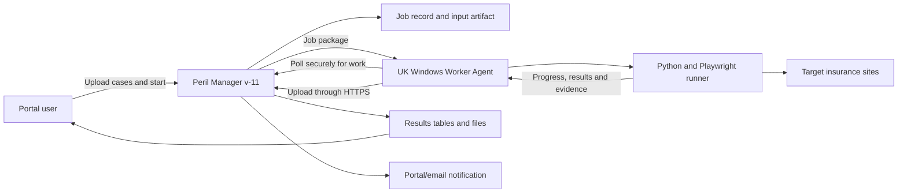

Yes, your descriptions are essentially correct. The important refinement is that “timed” and “Portal-operated” describe different dimensions:

- Manual/timed describes **when and by whom a run is triggered**.
- Stand-alone/Portal-operated describes **how inputs, results and status are exchanged**.

A scheduled run can therefore be either stand-alone or Portal-integrated.

## The three practical modes

| Mode                  | Trigger                               | Input/results                           | User experience                            |
| --------------------- | ------------------------------------- | --------------------------------------- | ------------------------------------------ |
| Manual stand-alone    | Operator runs a command               | Local folders                           | Operator copies files and collects results |
| Scheduled stand-alone | Windows Task Scheduler                | Local folders                           | Operator checks later; optional email      |
| Portal-operated       | User or Portal schedule creates a job | Portal uploads/downloads through an API | Users work entirely in Peril Manager v-11  |

A scheduled Portal job is also possible: the Portal creates the weekly job automatically, the Worker executes it, and users receive the same Portal notification as for a manually submitted Portal job.

## How the Portal should steer the Worker

My recommendation is that the Portal should **not remotely log into the Windows machine and execute PowerShell**. It should also not control Playwright browser actions one by one.

Instead, the Worker should run a small, continuously available **Worker Agent**. The Portal manages jobs; the Worker Agent fetches and executes them.



The Portal “starts” the work in a business sense. Technically, the Worker asks:

> “Is there a job for me?”

This is normally called a **pull model**.

### Why the Worker should ask the Portal

The Worker only needs to make an outbound HTTPS connection, normally through port 443. IT does not have to open an incoming connection to the Windows machine.

This is especially advantageous if the Worker:

- has a changing IP address
- is behind a corporate or household router
- is in another office
- is a Windows PC rather than a server
- should not expose a remotely callable Python service

The target insurer still sees the UK Worker’s IP address because Playwright and the browser run on that machine. The Portal connection does not change the browser traffic’s origin.

## Example of a Portal-operated run

1. A user uploads an Excel or CSV file in the Portal.
2. The Portal validates it and saves an immutable input version.
3. The Portal creates job `PC-2026-0042`, initially with status `Queued`.
4. The Worker Agent contacts the Portal, identifies itself and asks for work.
5. The Portal assigns the job to that Worker.
6. The Worker downloads the input package.
7. Python and Playwright process the cases locally.
8. The Worker regularly reports progress, for example:
   - 250 cases received
   - 137 completed
   - 126 successful
   - 11 failed
   - currently processing case 138
   - last contact 14:32
9. Results are uploaded, preferably in checkpoints rather than only at the end.
10. The Portal validates and imports the results.
11. The job becomes `Completed`, `Completed with warnings` or `Failed`.
12. Authorised users receive a Portal notification and optionally an email containing a link.
13. Users browse, filter, compare and export the results without accessing the Worker.

The email should generally contain a link, not attach input or result data.

## What actually runs on the Worker

The Worker can have three layers:

1. **Worker Agent**

   Connects to the Portal, obtains jobs, reports progress and uploads results.

2. **Job runner**

   Starts the appropriate Python command with a controlled input directory and job identifier.

3. **Target implementations**

   The individual HUK, portal or competitor scripts, with or without Playwright.

Conceptually:

```
Worker Agent
    receives job PC-2026-0042
        creates isolated working directory
            input/
            output/
            logs/
            screenshots/
        launches:
            python run_comparison.py --job PC-2026-0042
        monitors execution
        uploads results
        cleans or archives local working data
```

The same comparison script should ideally support all three modes. The difference is the wrapper:

```
Manual:
Local file → comparison runner → local result

Scheduled:
Task Scheduler → comparison runner → local result

Portal:
Worker Agent → comparison runner → result uploaded to Portal
```

This avoids maintaining separate comparison logic.

## What happens if the Worker is unavailable?

The Portal cannot run a switched-off or sleeping PC.

The job remains in a state such as:

- `Queued — waiting for UK Worker`
- `Worker offline — last seen 09:42`
- `Running`
- `Upload pending`
- `Completed`

For dependable unattended operation, the machine should be:

- powered on during the execution window
- configured not to sleep
- connected reliably to the internet
- running under a dedicated restricted Windows account
- configured to start the Worker Agent after reboot

A dedicated VM or small PC is more reliable than an employee laptop.

## Worker Agent: Windows service or scheduled task?

Two implementations are reasonable.

### Windows service

The Worker Agent starts with Windows and polls continuously or every few seconds.

Advantages:

- Portal jobs start quickly.
- Continuous heartbeat and status.
- Good for a dedicated production Worker.

Playwright would normally run headlessly. If visual operator intervention is required, a Windows service is less suitable because services do not have an ordinary interactive desktop.

### Windows Task Scheduler

A scheduled task starts the Worker Agent every minute, or keeps it running for a defined period.

Advantages:

- Simpler installation and IT review.
- No custom Windows service is necessary.
- Suitable for the pilot.

It can be configured to run whether or not a user is logged in. The machine must nevertheless be awake.

For the pilot, I would begin with Task Scheduler or a manually started Agent. A Windows service becomes attractive when the operational process is proven.

## Security model

The Worker should authenticate as a machine, not as a human Portal user. Suitable mechanisms include a machine-specific client certificate or narrowly scoped API credentials.

The Worker should only be permitted to:

- announce its availability
- collect jobs assigned to it
- download those jobs’ inputs
- report status
- upload results and evidence

It should not receive general Portal database access. It should not be able to browse other documents or impersonate a user.

Further controls should include:

- HTTPS encryption
- input and result checksums
- a dedicated low-privilege Windows account
- restricted local folders
- pinned Python and Playwright versions
- controlled browser updates
- retention and deletion rules for local data
- audit records for every job and artifact

## Reliability features the Portal integration needs

A Portal-started job is more than a remote `python` command. The orchestration layer needs:

- job states and timestamps
- Worker identity and heartbeat
- a job lock or lease so two Workers cannot execute the same job
- progress counters
- retries
- timeout handling
- cancellation requests
- duplicate protection
- partial-result checkpoints
- structured error reporting
- input, result and log artifacts
- notification handling

For example, once the Worker claims a job, it receives a ten-minute lease. It renews that lease through heartbeats. If it disappears, the Portal can eventually return the job to the queue instead of leaving it permanently marked as running.

Cancellation should normally be cooperative: the Portal sets `Cancellation requested`, and the Worker stops safely after the current case rather than being killed in the middle of writing data.

## Files versus browsable Portal results

There are two different levels of Portal integration:

1. **Artifact-only integration**

   The Portal stores the uploaded input and returned Excel/CSV result. Users can share and download the files.

2. **Data integration**

   The Portal imports result rows into database tables. Users can then filter, search, aggregate, compare runs, create reports and export selected data.

The comfortable experience you describe requires the second level. Merely starting Python from the Portal does not automatically make the results browsable. Result schemas, database tables, DTOs, import validation and access permissions must also be implemented.

I would retain both:

- normalized Portal tables for everyday work and reporting
- the original input, raw output, logs and possibly screenshots as auditable artifacts

## Alternative: Portal pushes directly to the Worker

It is technically possible for the Portal to call an HTTP endpoint on the Worker:

```
Portal → POST <https://uk-worker/run>
```

But this requires:

- a stable route to the Worker
- an incoming firewall rule
- a listening service
- TLS certificates
- strong authentication
- handling dynamic IP addresses or VPN connectivity
- a larger exposed attack surface

It can be acceptable inside a tightly controlled corporate network, but it is not my first choice. The outbound polling model is simpler and safer, particularly for a remote UK Windows machine.

## Recommended implementation

For the pilot:

- one dedicated UK Windows 11 Worker
- one Worker Agent, started manually or by Task Scheduler
- outbound HTTPS connection to the Portal
- one job at a time
- Portal job queue and status page
- final and checkpoint result uploads
- Portal and optional email notifications
- normalized result import plus downloadable original files

Thus, “Portal-operated” means that the operator never handles the Worker machine. They work entirely in Peril Manager v-11. The Portal controls **what should run, when, with which input and for whom**; the Worker remains responsible for **how the browser automation is executed locally**.